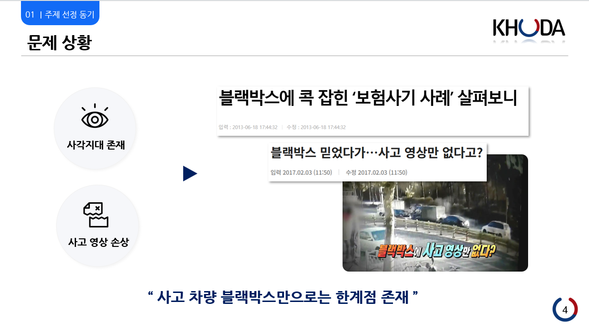
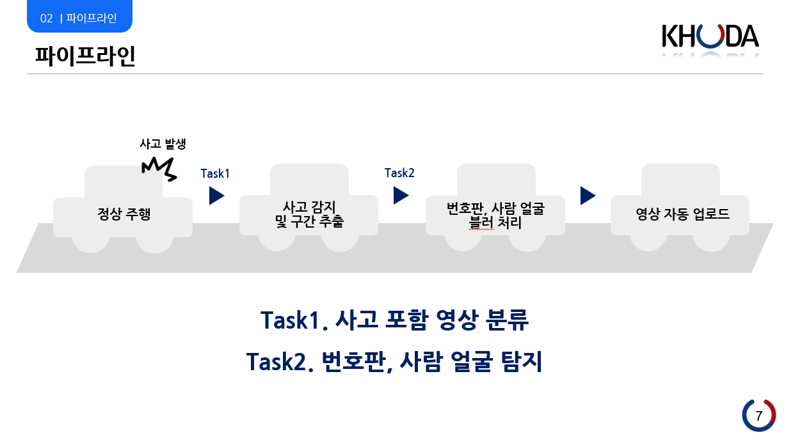
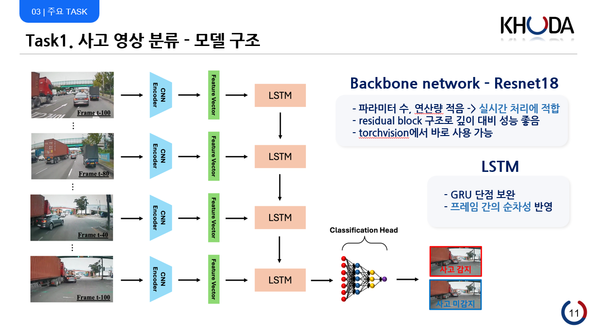
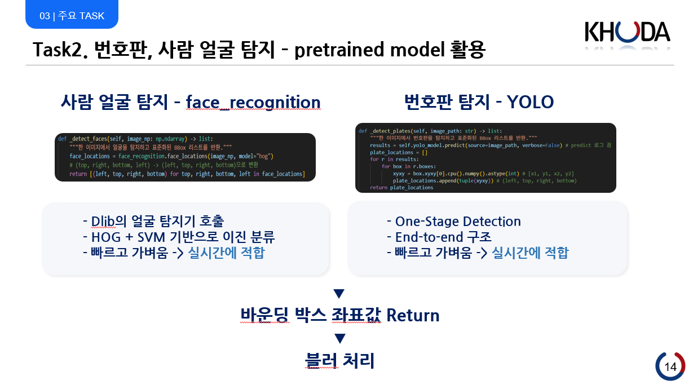

# 🚗 ClipBox: AI 사고 영상 임베디드 시스템

---

## 🏷️ 1. 프로젝트 설명

**ClipBox**는  
AI 기반 임베디드 시스템을 활용해교통사고 발생 시 자동으로 사고를 감지, 영상을 수집·분류·공유하는 솔루션입니다.

---

## ⚠️ 2. 문제 상황

- 블랙박스만으로 사고 입증이 어렵습니다.
- 사각지대, 영상 손상, 영상 미존재 등 한계가 있습니다.
- 사고 차량 블랙박스만으로는 한계점이 존재합니다.

---

## 🛠️ 3. 해결 방안

- AI 임베디드 시스템이 사고를 자동 감지합니다.
- 사고 영상은 자동 수집 및 분류됩니다.
- 번호판과 얼굴 등 개인정보는 자동 블러 처리됩니다.
- 영상은 실시간으로 업로드 및 공유됩니다.

---

## 🔄 4. 파이프라인

- 블랙박스에서 실시간으로 영상을 입력받습니다.
- Task1에서는 사고 분류기(classifier) 모델을 사용해 라이브 스트림에서 사고 여부를 실시간으로 감지합니다.
- 사고가 감지되면 해당 구간의 영상이 자동으로 추출됩니다.
- Task2에서 번호판과 얼굴을 탐지해 개인정보를 블러 처리합니다.
- 처리된 영상은 웹 서버로 자동 업로드되고, 지도 기반으로 사용자와 공유됩니다.
---

## 🤖 5. 모델

- Task1 사고 영상 분류에는 ResNet18과 LSTM을 결합한 모델을 사용합니다.
- ResNet18의 block4를 제거하여 feature vector 크기를 256으로 줄였습니다.
- LSTM으로 프레임 순차성을 반영합니다.
- 100프레임씩, stride 20 sliding window 방식으로 사고 포함 여부를 분류합니다.
- 최초 사고 구간 100프레임과 150프레임을 합쳐 250프레임을 추출합니다.
  

- Task2 얼굴 탐지는 Dlib(face_recognition) 기반으로, HOG와 SVM을 사용해 실시간 얼굴 탐지가 가능합니다.
- 번호판 탐지는 YOLO(one-stage detection) 모델을 사용하며, 실시간으로 바운딩 박스를 반환하고 감지 영역은 자동 블러 처리됩니다.
- 두 작업 모두 face_recognition_YOLO.png 이미지를 참고 이미지로 사용합니다.

---

## 🎥 6. 구현 영상

- 실제 시스템 동작 과정을 시연 영상에서 확인할 수 있습니다.

---
